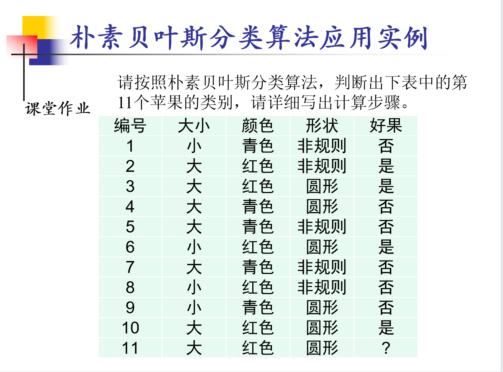
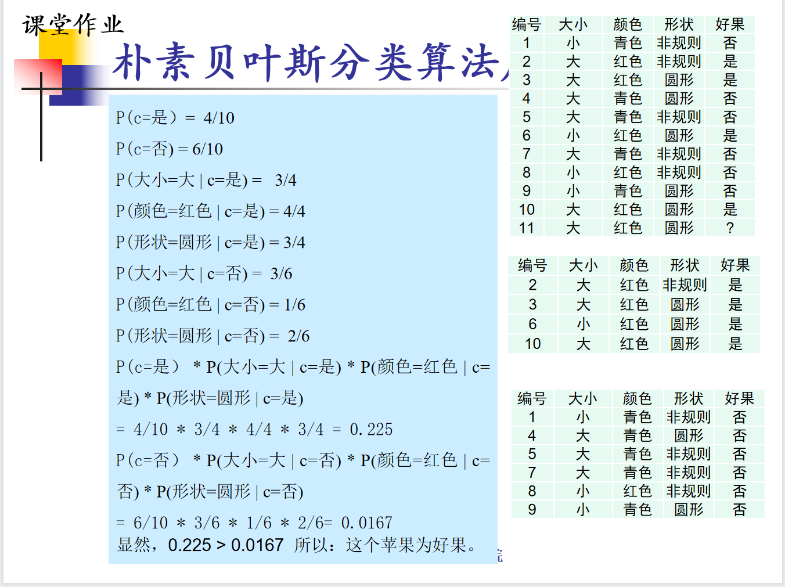

# 数据挖掘复习

## 朴素贝叶斯分类算法

### 课堂作业（重点）

步骤：

前提：10条已知数据，有一个条未知数据判断是否为好果

1.以结果（是/否）为分类计算概率：P（c=是）=4/10，P（c=否）=6/10

2.用第11条数据的三个特征算条件概率：在4个是好果中，有3个大小是大的果P（大小=大|c=是）=3/4，依次类推

3.结果为“是”和“否”的条件概率分别有3个，是一类的相乘，否一类的相乘，得出两个概率，谁的概率大谁就是对应的结果。

### 另一个实例

 12个数据，6个嫁，6个不嫁

p（嫁）=1/2,p (不嫁) =1/2

嫁6：p（帅|嫁）=1/2  p(性格好|嫁)=5/6 p(矮|嫁)=1/6 p(不上进|嫁)=1/6

不嫁6：p（帅|不嫁）=5/6  p(性格好|不嫁)=1/6  p(矮|不嫁)=1 p(不上进|不嫁)=1/2

p(嫁) * p(帅|嫁) *  p(性格好|嫁) * p(矮|嫁) * p(不上进|嫁)=5/(4 * 6 * 6*6)

p (不嫁) * p（帅|不嫁）* p(性格好|不嫁) * p(矮|不嫁) * p(不上进|不嫁)=5/(4 * 6 *6)

p(嫁)<p(不嫁)

所以不嫁

这不是简简单单！

## 关联规则挖掘——Apriori算法

### 课堂作业（重点）

最小支持度计数min_sup=3，表示会去除不满足次数不足3次的候选项

频繁k项集生成频繁k+1项集，就是排列组合。

### 例题

支持度=项集中的元素同时出现的次数/总的数量，比如一共有5条数据，烤鸭、面饼、面酱同时出现有2条。即2/5

置信度=项集中的元素同时出现的次数/关联规则前项出现的次数，比如烤鸭-》面饼、面酱，包含烤鸭的有3条数据，他们同时出现的数据有2条，即2/3

## 决策树分类算法

### 熵和信息增益

### ID3算法实例分析

0.9537为决策属性的熵

要继续决策下去，要在全是青年的数据里再进行一次ID3算法

过程略，得出的结果如下，若要再分，以此类推

